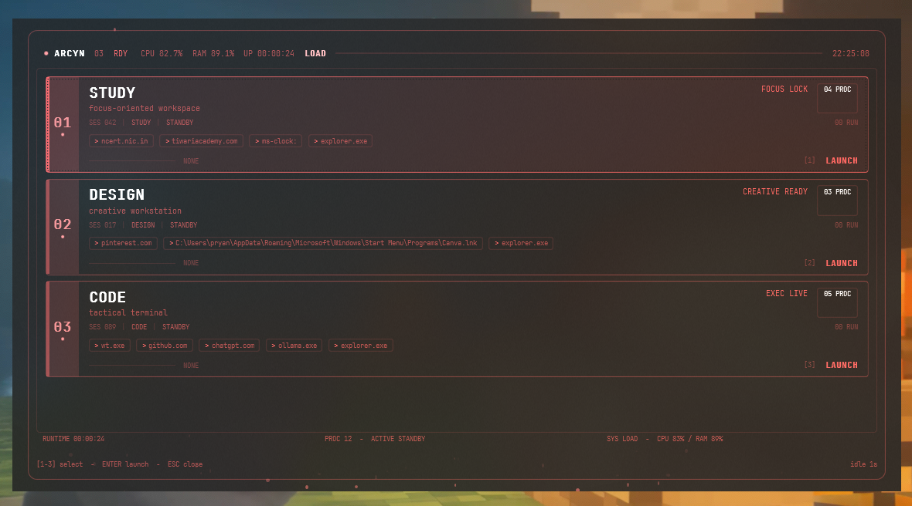

    █████  ██████  ██████ ██   ██ ███   ██
   ██   ██ ██      ██     ██   ██ ████  ██
   ███████ █████   ██     ███████ ██ ██ ██
   ██   ██ ██      ██     ██   ██ ██  ████
   ██   ██ ██████  ██████ ██   ██ ██   ███

# ARCYN

[](https://github.com/bugged-bit/ARCYN)
[](LICENSE)
[](https://dotnet.microsoft.com/download/dotnet/8.0)
[](https://github.com/bugged-bit/ARCYN)
[](https://github.com/bugged-bit/ARCYN/releases)

**Tactical workspace launcher — modes, apps, folders, websites at your fingertips.**

ARCYN is a HUD-style launcher that opens your apps, websites, and folders together with one click or keypress. Configure workspaces ("modes") and launch your entire stack instantly.



---

## Features

- **Mode-based launching** — each mode opens a set of apps, websites, and folders
- **Keyboard-first** — press `1`–`9` to launch, arrows to navigate, `Enter` to confirm
- **Tactical HUD aesthetic** — dark red-on-black acrylic interface with particle effects
- **Per-mode accent colors** — customize each mode's color
- **Fully configurable** — edit `arcyn.json` or use the built-in wizard
- **Telemetry display** — live CPU/RAM monitoring
- **First-run setup wizard** — guided configuration for new users
- **CLI setup** — `ARCYN --setup` for headless/terminal configuration
- **Import/Export** — share your config between machines

---

## Migration Status

- [x] 1. Refactor core services – decouple UI from business logic
- [x] 2. Remove dead code – eliminate unused XAML resources, AssemblyInfo, and orphaned methods
- [x] 3. Consolidate duplicate utility methods – merge type converters, brush helpers
- [x] 4. Create ARCYN.Core class‑library – shared models and services
- [x] 5. Extract UI logic into ViewModels – MVVM pattern for WPF and Avalonia
- [x] 6. Add Avalonia UI project – cross‑platform HUD window
- [x] 7. Update CI pipeline – split WPF and Avalonia matrix builds
- [x] 8. Clean up .csproj files – remove unused packages, centralise versions
- [x] 9. Update README with migration status checklist – keep stakeholders informed
- [x] 10. Introduce xUnit test project – ensure regression coverage
- [x] 11. Add CI step to run `dotnet build -warnaserror` – enforce code quality
- [x] 12. Add CI step to verify app launches via Playwright – after migration

---

## Prerequisites

- [.NET 8 SDK](https://dotnet.microsoft.com/download/dotnet/8.0) (required for building)

---

## Quick start

### Download (prebuilt)

1. Download the latest `ARCYN` from [Releases](https://github.com/bugged-bit/ARCYN/releases)
2. Run `./ARCYN`
3. Follow the setup wizard to create your first mode

### Build from source

```bash
git clone https://github.com/bugged-bit/ARCYN.git

# Windows (WPF)
cd ARCYN/ARCYN.UI
dotnet restore
dotnet build -c Release
dotnet publish -c Release --self-contained true

# Linux (Avalonia)
cd ARCYN/ARCYN.Avalonia
dotnet restore
dotnet build -c Release
dotnet publish -c Release --self-contained true
```

### CLI setup (headless)

```bash
./ARCYN --setup
```

Prompts for mode name, apps, folders, and websites in the terminal. Saves config then launches HUD on next run.

---

## Configuration

ARCYN stores its config at:

- `~/.config/ARCYN/arcyn.json` (user config, default)
- `./arcyn.json` (portable — overrides user config)

### Example `arcyn.json`

```json
{
  "theme": {
    "accent": "#D64545",
    "glow_opacity": 0.28,
    "scanlines": true,
    "animations": true
  },
  "behavior": {
    "idle_timeout_seconds": 10,
    "always_on_top": true,
    "close_on_launch": true
  },
  "modes": [
    {
      "name": "CODE",
      "description": "Development stack",
      "accent": "#D64545",
      "apps": ["code", "firefox"],
      "websites": ["https://github.com"],
      "folders": []
    }
  ]
}
```

### Config reference

| Field | Type | Default | Description |
|-------|------|---------|-------------|
| `theme.accent` | string | `"#D64545"` | Global accent color (hex) |
| `theme.glow_opacity` | number | `0.28` | Ambient glow intensity (0–1) |
| `theme.scanlines` | bool | `true` | CRT scanline overlay |
| `theme.animations` | bool | `true` | Enable/disable animations |
| `theme.reduced_effects` | bool | `false` | Disable particles, trail, glow, boot animation (low-end systems) |
| `theme.compact_mode` | bool | `false` | Compact card sizing (more modes visible at once) |
| `behavior.idle_timeout_seconds` | int | `10` | Auto-close after inactivity (0 = disable) |
| `behavior.always_on_top` | bool | `true` | Keep window above other apps |
| `behavior.close_on_launch` | bool | `true` | Close ARCYN after launching a mode |
| `modes[].name` | string | — | Mode display name |
| `modes[].description` | string | `""` | Short description |
| `modes[].accent` | string | `"#D64545"` | Per-mode accent color (hex) |
| `modes[].apps` | string[] | `[]` | Application names/paths |
| `modes[].websites` | string[] | `[]` | URLs to open |
| `modes[].folders` | string[] | `[]` | Folder paths to open |

### Customization tips

- **Reorder modes** — right-click a card → Move Up/Down
- **Duplicate a mode** — right-click → Duplicate
- **Change accent color** — right-click → Edit → pick a color
- **Theme presets** — change `theme.accent` for instant recoloring

---

## Keyboard shortcuts

| Key | Action |
|-----|--------|
| `1`–`9` | Launch mode by position |
| `↑` / `↓` or `←` / `→` | Navigate between modes |
| `Enter` | Launch selected mode |
| `Esc` | Cancel launch / Close ARCYN |
| `Alt`+`Shift`+`D` | Global hotkey (requires launch script) |

---

## Project structure

```
ARCYN/
  ARCYN.sln                   Solution file
  example.arcyn.json          Example config
  arcyn.schema.json           JSON Schema
  scripts/                    Optional launch scripts
  ARCYN.UI/
    App.xaml(.cs)             Startup + error handling
    AppState.cs               Phase state machine
    MainWindow.xaml(.cs)      HUD window + input routing
    SetupWindow.xaml(.cs)     First-run setup wizard
    EditModeWindow.xaml(.cs)  Mode editor dialog
    ParticleEngine.cs         Ambient particle system
    TelemetryMonitor.cs       CPU/RAM sampling
    NativeMethods.cs          Platform interop
    Models/
      ArcynConfig.cs          Root config model
      ModeConfig.cs           Mode + target models
    Services/
      ConfigService.cs        Config load/save/validate/migrate
      ModeService.cs          Mode CRUD + selection
      LaunchService.cs        Process launch logic
      ThemeService.cs         Brush resolution + presets
      AnimationService.cs     Fade/resize/scale helpers
      RenderService.cs        Render loop subscriber
      LogService.cs           Async file logger
    Styles/
      Theme.xaml              Visual theme + styles
    Assets/Fonts/             JetBrainsMono Nerd Font
```

---

## Build

```bash
# Windows (WPF)
cd ARCYN/ARCYN.UI
dotnet restore
dotnet build -c Release
dotnet publish -c Release --self-contained true

# Linux (Avalonia)
cd ARCYN/ARCYN.Avalonia
dotnet restore
dotnet build -c Release
dotnet publish -c Release --self-contained true
```

Requires .NET 8 SDK.

---

## Contributing

See [CONTRIBUTING.md](CONTRIBUTING.md).

---

## License

[MIT](LICENSE)
